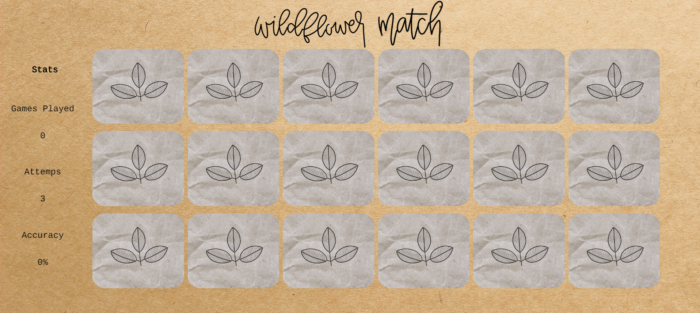

# Wildflower match

A memory matching game with a wildflower theme

## Technologies Used
- JavaScript
- jQuery
- HTML5
- CSS3

## Live Demo
Link: https://wildflower-match.andieswift.dev/

## Features
- Users can click on image cards to begin the memory matching process
- The app will keep track of number of games played
- The app will count number of attemps the user has made
- The app will calculate accuracy

## Example of App

